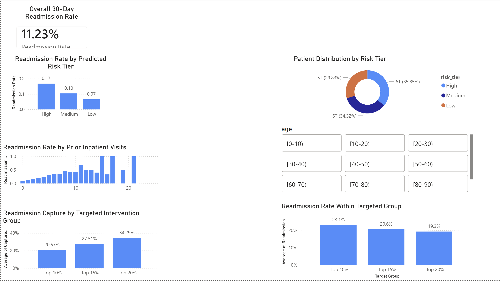

# Hospital 30-Day Readmission Risk (Logistic Regression + Power BI)

This project builds an end-to-end healthcare analytics workflow to predict 30-day hospital readmission risk and translate model outputs into an operational intervention strategy.

## Dashboard Preview

## Problem
Hospitals want to reduce 30-day readmissions. Resources are limited, so the goal is to identify a small high-risk cohort for targeted interventions.

## Dataset
UCI ML Repository: Diabetes 130-US hospitals (1999–2008).  
Files used: `diabetic_data.csv`, `IDS_mapping.csv`.

## Approach
- Data cleaning + feature engineering (Python)
- Baseline model: Logistic Regression (ROC-AUC ≈ 0.636)
- Risk tiers (Low/Medium/High) using predicted probabilities
- Operational simulation: capture rate for top 10/15/20% highest-risk patients
- Power BI dashboard for decision support

## Key Results
- Overall readmission rate: ~11.2%
- Risk tier readmission rates:
  - Low: ~6.5%
  - Medium: ~10.4%
  - High: ~16.7%
- Targeting strategy:
  - Top 10% captures ~21% of readmissions (group readmission rate ~23%)
  - Top 15% captures ~28% of readmissions (group readmission rate ~21%)
  - Top 20% captures ~34% of readmissions (group readmission rate ~19%)

## Repository Structure
- `scripts/` : data prep, modeling, risk scoring, capture rate analysis
- `data/` : ignored in git (raw and processed data stored locally)
- `outputs/` : optional exports/screenshots

## How to Run
1. Create venv and install dependencies:
   - `python -m venv .venv`
   - `.venv\Scripts\activate`
   - `pip install -r requirements.txt`

2. Run scripts in order:
   - `python scripts/01_load_and_clean.py`
   - `python scripts/02_feature_engineering.py`
   - `python scripts/03_eda_and_logreg.py`
   - `python scripts/04_risk_tiers.py`
   - `python scripts/05_capture_rate_analysis.py`
   - `python scripts/06_random_forest.py`
   - `python scripts/07_logistic_feature_effects.py`

## Dashboard
Power BI dashboard built from `scored_data.csv` (generated locally by script 04).