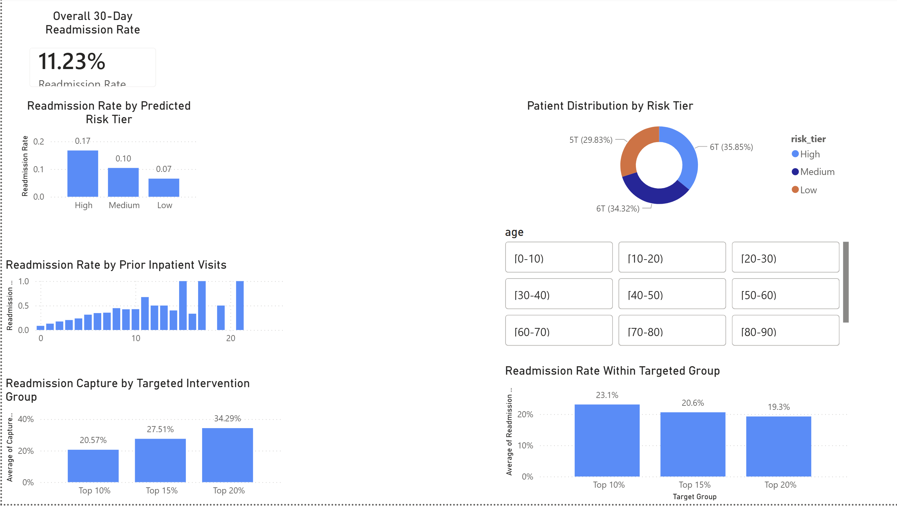

# Healthcare Readmission Risk Dashboard

This project analyzes hospital readmission risk using patient demographics, clinical variables, and operational metrics.  
It provides a Power BI dashboard designed for healthcare quality improvement teams. 

This project aims to:

- Predict the probability of patient readmission within 30 days  
- Stratify patients into actionable risk tiers  
- Simulate targeted intervention strategies (Top 10–20% highest-risk patients)

---

## 🎯 Project Objectives
• Analyze patient readmission patterns  
• Identify risk factors (age, LOS, comorbidities, diagnosis groups)  
• Visualize clinical KPIs for hospital operations  
• Support data‑driven decision‑making in healthcare settings  

---

## 🛠 Tools & Technologies
• Power BI  
• DAX  
• Excel / CSV healthcare datasets  
• GitHub for version control  

---

## 📊 Dashboard Features
• Readmission rate by demographic group  
• Length of stay (LOS) distribution  
• Comorbidity analysis  
• Diagnosis category breakdown  
• Interactive slicers for filtering  

---

## 📈 Key Insights (Sample)
• Older patients had higher readmission risk  
• Longer LOS correlated with increased readmission probability  
• Certain diagnosis groups showed significantly higher risk  
• High‑risk patients could be flagged for follow‑up care  

---

## 🖼 Dashboard Preview 

---

## 🚀 Future Improvements
• Add predictive modeling using Python  
• Integrate SQL data source  
• Add drill‑through pages for patient‑level analysis  

---

## Dataset

**Source:** UCI Machine Learning Repository  
**Dataset:** Diabetes 130-US Hospitals (1999–2008)

Files used:
- `diabetic_data.csv`
- `IDS_mapping.csv`

---

## Analytical Approach

- Data cleaning and feature engineering (Python)
- Baseline classification model: Logistic Regression  
  - **ROC-AUC ≈ 0.636**
- Patient risk stratification:
  - Low Risk
  - Medium Risk
  - High Risk
- Operational targeting simulation:
  - Top 10%, 15%, and 20% highest-risk patients
- Power BI dashboard for decision support

---

## Key Findings

**Overall 30-day readmission rate:** ~11.2%

### Risk Stratification Results

| Risk Tier | Readmission Rate |
|-----------|------------------|
| Low       | ~6.5%            |
| Medium    | ~10.4%           |
| High      | ~16.7%           |

### Operational Targeting Simulation

| Target Group | % of Readmissions Captured | Readmission Rate Within Group |
|-------------|-----------------------------|-------------------------------|
| Top 10%     | ~21%                        | ~23%                          |
| Top 15%     | ~28%                        | ~21%                          |
| Top 20%     | ~34%                        | ~19%                          |

This indicates that focusing on the highest-risk 10% of patients could proactively address approximately **21% of total readmissions**.

---

## Model Drivers (Logistic Regression)

Odds ratio analysis suggests that readmission risk is primarily associated with:

- Prior inpatient utilization  
- Number of diagnoses  
- Emergency department visits  
- Length of hospital stay  
- Patient age group  

These findings align with clinical expectations around patient complexity and healthcare utilization history.

---

## Repository Structure

- `scripts/`
  - 01–02: Data preparation and feature engineering  
  - 03–04: Logistic regression modeling and risk scoring  
  - 05: Capture rate analysis  
  - 06: Random forest comparison  
  - 07: Logistic regression odds ratio interpretation  

- `data/` (git-ignored): raw and processed datasets  
- `assets/`: dashboard screenshots  
- `requirements.txt`
